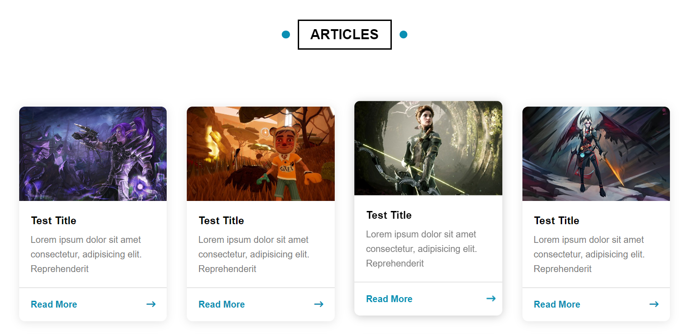
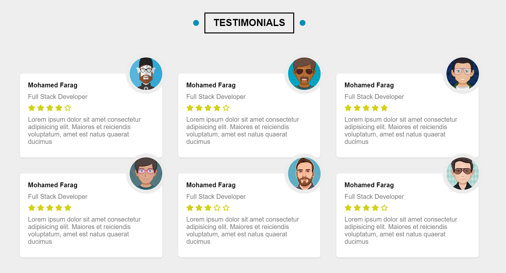
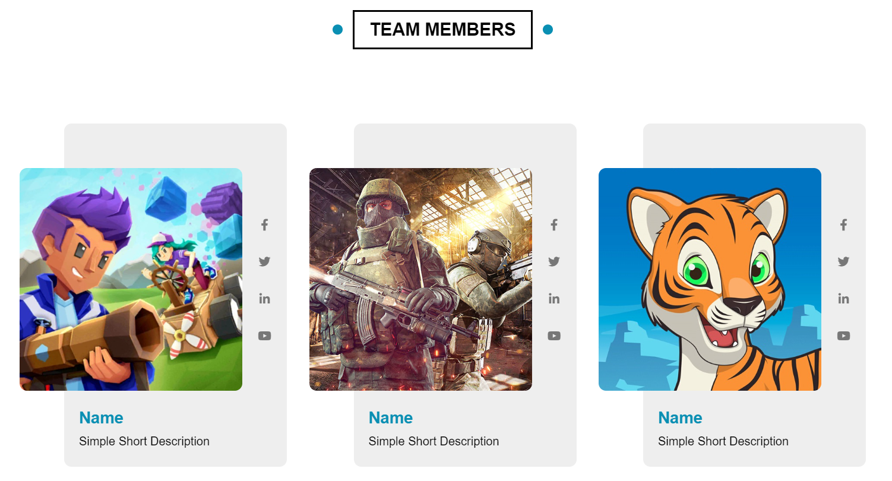
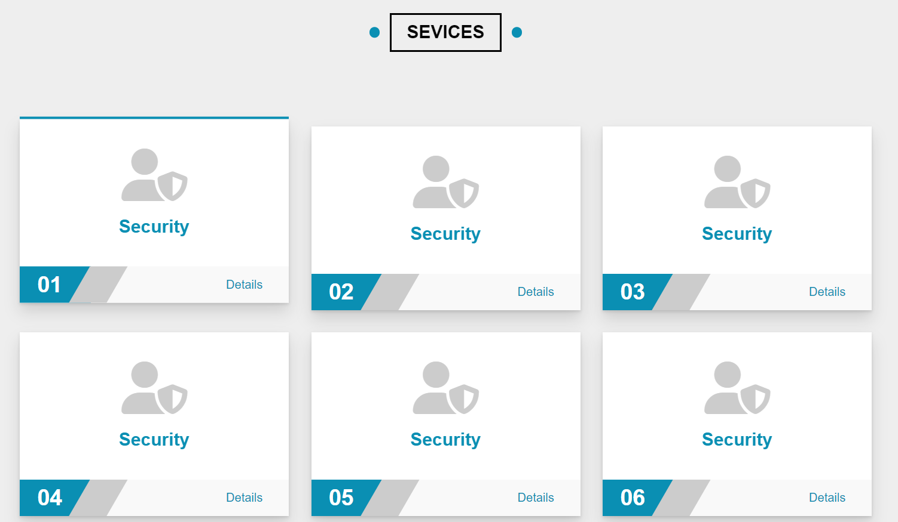

# HTML/CSS Template

this is a responsive HTML/CSS template

## Features

- Responsive layout that adapts to different screen sizes and devices.
- Clean and modern design.
- Easy to customize and extend with your own content.
- Well-structured HTML and CSS code for maintainability.

## Preview

## Usage

1. Download or clone the repository to your local machine.
2. Open the `index.html` file in your preferred web browser.
3. Replace the placeholder content with your own text, images, and other elements.
4. Customize the styles in the `styles.css` file to match your branding or design preferences.
5. Add additional HTML pages or modify the existing ones as needed.
6. Deploy the template to your web server or hosting provider if you want to make it publicly accessible.
